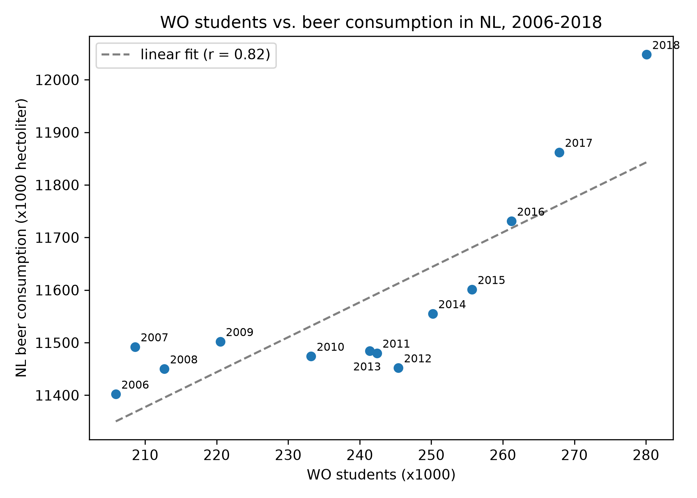

# Solution - Max Kowalchuk

**Student ID:** 14032031

## Papers

- MCC Van Dyke et al., 2019 - Fantastic yeasts and where to find them: the hidden diversity of dimorphic fungal pathogens
- JT Harvey, Applied Ergonomics, 2002 - An analysis of the forces required to drag sheep over various surfaces
- DW Ziegler et al., 2005 - The neurocognitive effects of alcohol on adolescents and college students

## Plot

I plotted the number of WO students against the beer consumption in the Netherlands, with each point labeled by its year. The correlation is pretty strong (r = 0.82), so at first glance it looks like more students means more beer.

But both variables mostly just increase over time, so the year is probably the real link here and not the students themselves. Between 2007 and 2013 the beer consumption barely changes while the number of students keeps growing, and most of the correlation comes from the last few years (2014-2018). So this is an example of correlation not meaning causation, and with only 13 data points I wouldn't draw any strong conclusions from it.
